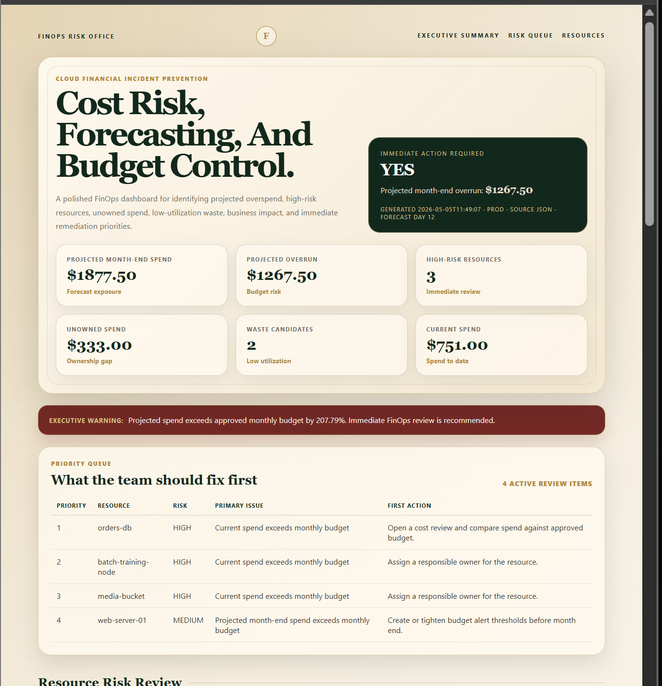
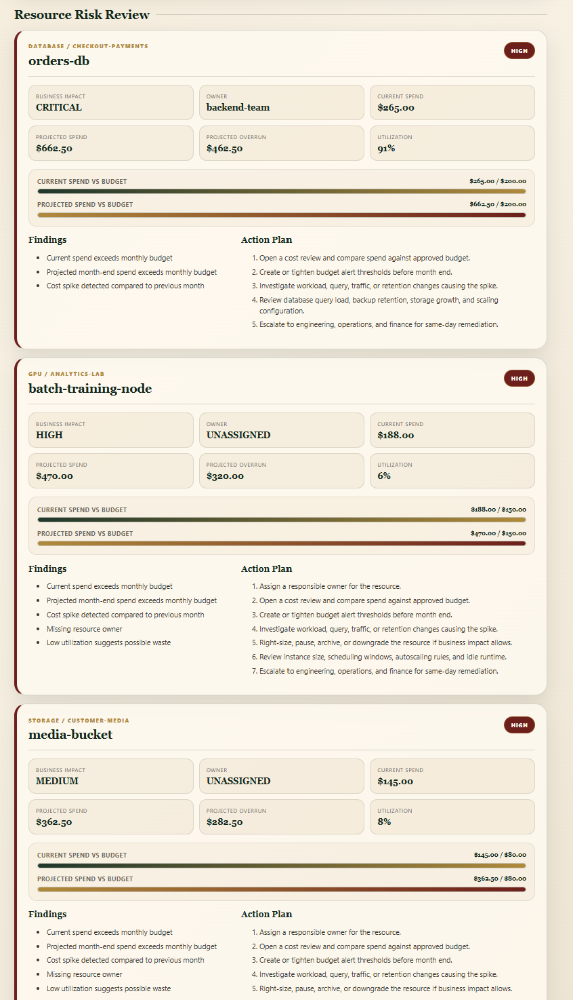

# Cloud FinOps Anomaly Detection And Cost Risk System

## Overview

This project simulates a cloud financial operations early-warning system used to detect budget overruns, cost spikes, unowned resources, low-utilization waste, projected month-end overspend, and high-risk services before cloud spend becomes a business problem.

It includes a polished executive HTML dashboard with a clean old-money visual style, designed for finance, operations, and cloud support review.

---

## Dashboard Preview

The dashboard is generated here:

- dashboard/finops-dashboard.html

Screenshots:

---

## Project Objective

To analyze cloud cost records and classify financial risk using current spend, previous spend, budget limits, ownership, utilization, service criticality, and projected month-end forecasting.

The system focuses on:

- Cloud Cost Anomaly Detection
- Projected Month-End Spend Forecasting
- Budget Overrun Detection
- Month-Over-Month Spike Detection
- Missing Ownership Detection
- Low-Utilization Waste Detection
- Blast-Radius And Business Impact Scoring
- Executive Risk Summary Reporting
- Priority Queue For Immediate Action
- Remediation Action Plans
- HTML Dashboard Output
- Text, JSON, CSV, Alert, And API-Style Outputs

---

## Business Scenario

A company is experiencing unexpected cloud cost growth.

Finance may not see the full problem until the monthly bill arrives. Engineering may not know which resource is driving the spend. Operations may not know who owns the resource.

This system simulates an early-warning workflow that answers:

- Which resources are over budget?
- Which resources are projected to exceed budget by month end?
- Which services have the highest business impact?
- Which resources are unowned?
- Which resources look wasteful?
- What action should the team take first?

---

## System Architecture

- Data Layer: JSON And CSV Cloud Cost Records
- Forecasting Layer: Projected Month-End Spend Calculation
- Analysis Layer: Budget, Spike, Ownership, And Utilization Checks
- Risk Layer: Risk Scoring And Blast-Radius Classification
- Priority Layer: High-Risk And Medium-Risk Resource Queue
- Alert Layer: High-Risk FinOps Anomaly Alerts
- Logging Layer: Environment-Tagged Audit, Review, And Alert Events
- Reporting Layer: Executive Text Report, JSON Report, CSV Export, HTML Dashboard, And API-Style Output

---

## Dashboard Features

- Executive Risk Summary Cards
- Immediate Action Required Panel
- Executive Warning Strip
- Priority Queue For High-Impact Items
- Risk-Sorted Resource Cards
- HIGH, MEDIUM, And LOW Risk Badge Styling
- Current Spend Vs Budget Progress Bars
- Projected Spend Vs Budget Progress Bars
- Generated Timestamp, Environment, Source, And Forecast Day
- Action Plans For Each Resource

---

## Executive Summary Metrics

The report and dashboard highlight:

- Total Monthly Budget
- Total Current Spend
- Projected Month-End Spend
- Projected Month-End Overrun
- Projected Overrun Percentage
- High-Risk Resources
- Medium-Risk Resources
- Unowned Current Spend
- Waste Candidates
- Immediate Action Required

---

## Project Structure

- data/cloud_costs.json
- data/cloud_costs.csv
- reports/finops_cost_risk_report.txt
- reports/finops_cost_risk_report.json
- reports/finops_cost_risk_report.csv
- alerts/finops_anomaly_alerts.txt
- logs/cost_events.log
- dashboard/finops-dashboard.html
- screenshots/cost-analysis.png
- screenshots/budget-alerts.png
- finops_cost_risk_analyzer.py
- README.md
- requirements.txt

---

## Technologies Used

- Python
- JSON
- CSV
- HTML
- CSS
- CLI Execution
- Cost Forecasting
- Risk Scoring
- Anomaly Detection
- Operational Logging
- Executive Reporting
- API-Style JSON Output

---

## How To Run

Run production-style cost analysis with forecasting, JSON export, CSV export, and dashboard output:

python finops_cost_risk_analyzer.py --env prod --source json --day 12 --export-json --export-csv --dashboard

Then open:

dashboard/finops-dashboard.html

Run using CSV as the input source:

python finops_cost_risk_analyzer.py --env prod --source csv --day 12 --export-json --export-csv --dashboard

Print API-style JSON output:

python finops_cost_risk_analyzer.py --env prod --source json --day 12 --api-output

---

## Planned Enhancements

- Add Daily Cost Trend Analysis
- Add Service-Level Budget Policy Configuration
- Add Owner Notification Simulation
- Add Forecast Confidence Scoring
- Add Interactive Filters For Dashboard View
- Add Scheduled Scan Simulation
- Add REST API Endpoint Using Flask Or FastAPI

---

## Real-World Relevance

This project reflects cloud support, FinOps, and operations responsibilities such as:

- Reviewing Cloud Resource Spend
- Investigating Unexpected Cost Increases
- Detecting Budget Overruns Before Month End
- Identifying Unowned High-Cost Resources
- Detecting Low-Utilization Waste
- Generating High-Risk Cost Alerts
- Producing Executive Cost Risk Reports
- Exporting Results For Engineering, Finance, And Operations Teams

---

## Professional Positioning

This project is designed as an entry-level cloud FinOps and cost-risk investigation simulation.

It demonstrates the ability to detect financial anomalies, forecast spend, classify business impact, generate alerts, prioritize risk, produce action-ready reports, and present findings in an executive dashboard.
